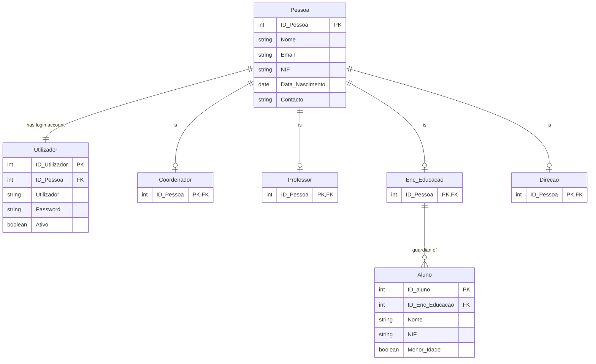
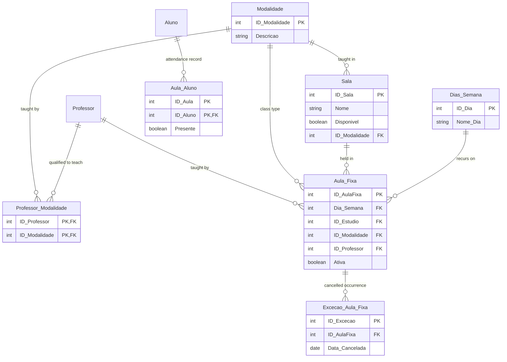
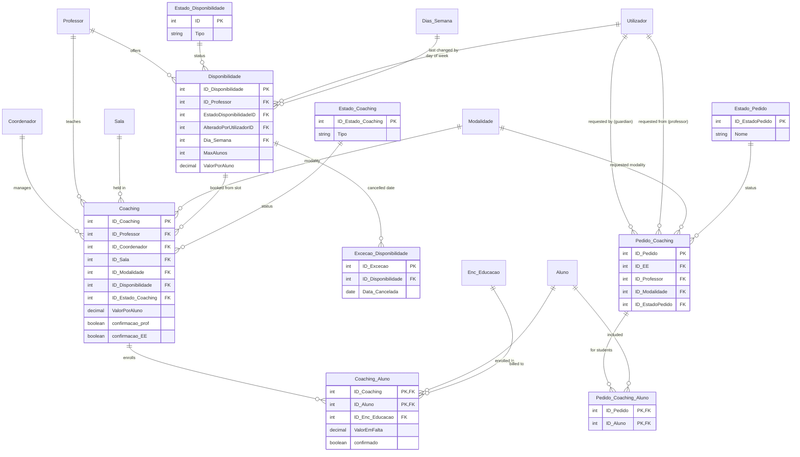
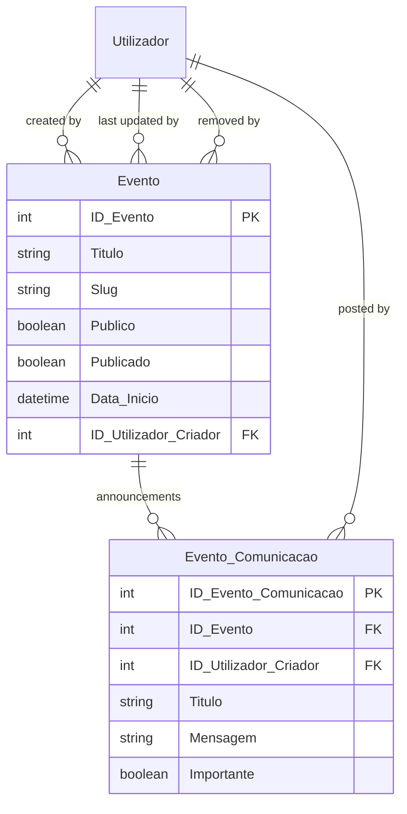
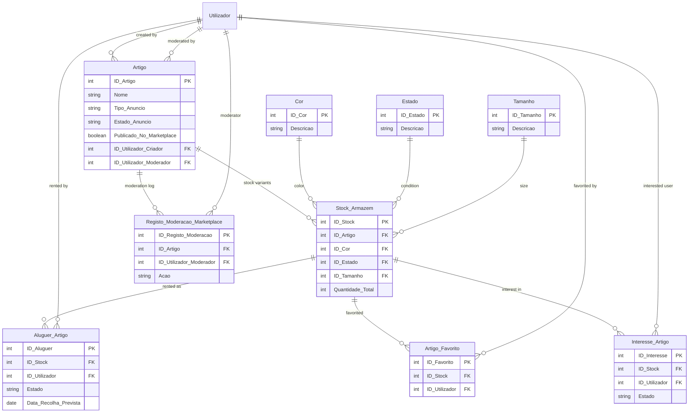

# EntConnect — Data Model

This document describes the database schema defined in [`Backend/prisma/schema.prisma`](../Backend/prisma/schema.prisma) (Prisma ORM, Microsoft SQL Server). It contains **34 business entities**; the schema also has a `sysdiagrams` model, which is a SQL-Server-internal table used by SSMS diagram tooling and is **not** part of the application's domain model, so it is excluded below.

Diagrams use [Mermaid](https://mermaid.js.org/syntax/entityRelationshipDiagram.html) `erDiagram` syntax, which renders natively on GitHub, Azure DevOps and in VS Code's Markdown preview, and stays diffable in Git.

**Cardinality legend**

| Symbol      | Meaning                  |
| ----------- | ------------------------- |
| `\|\|--\|\|` | exactly one — exactly one |
| `\|\|--o\|` | exactly one — zero or one |
| `\|\|--o{` | exactly one — zero or more |
| `}o--o{`   | many — many (via a junction/join table) |

Entities shown without an attribute box in a diagram (e.g. `Professor` inside the Scheduling diagram) are defined in full in another diagram and repeated here only to show the relationship — see the "Cross-references" note under each diagram.

Because the 34 entities don't fit legibly in a single diagram, they are grouped to match the Backend module boundaries (see main `Docs/README.md`).

---

## 1. People & Access

Core identity model: a `Pessoa` (person) can hold one or more roles (`Coordenador`, `Professor`, `Enc_Educacao`) and/or a login (`Utilizador`). `Aluno` (student) is a dependant managed by a guardian (`Enc_Educacao`) and has no login of its own.

- **Pessoa** — base person record (name, NIF, contact details) shared by every role.
- **Utilizador** — login account (username/password) linked 1:1 to a `Pessoa`.
- **Coordenador** — the school's management/coordination role (login role `Coordenador`).
- **Professor** — a teacher (login role `Professor`).
- **Enc_Educacao** — a legal guardian ("Encarregado de Educação"); this is the login role the original brief calls "Student", since students themselves (`Aluno`) don't log in — their guardian manages their account.
- **Direcao** — school board/direction role (present in the data model; not currently exposed as its own login role in `Backend/src/auth/enums/roles.enum.ts`).
- **Aluno** — a student/dependant, always linked to one guardian.

**Cross-references:** `Aluno` also relates to `Aula_Aluno`, `Coaching_Aluno` and `Pedido_Coaching_Aluno` (see §2/§3). `Enc_Educacao` also relates to `Coaching_Aluno` (§3). `Utilizador` also relates to entities in §3, §4 and §5. `Professor` also relates to entities in §2 and §3.

---

## 2. Scheduling & Classes

Recurring classes (`Aula_Fixa`) are taught in a studio (`Sala`), follow a modality (`Modalidade`), recur on a weekday (`Dias_Semana`), and can have one-off cancellations (`Excecao_Aula_Fixa`). `Aula_Aluno` records a student's attendance.

- **Sala** — a physical studio/room; optionally restricted to one `Modalidade`.
- **Modalidade** — a dance style/discipline (e.g. ballet, hip-hop).
- **Professor_Modalidade** — join table: which modalities a professor is qualified to teach.
- **Dias_Semana** — lookup table of weekdays.
- **Aula_Fixa** — a fixed/recurring weekly class slot.
- **Aula_Aluno** — attendance record of a student in a class occurrence. Note: `ID_Aula` is a plain column with **no Prisma-level relation** back to `Aula_Fixa` (only `ID_Aluno` is a modeled foreign key) — the link to the specific class exists at the database level but isn't declared as a Prisma relation in the current schema.
- **Excecao_Aula_Fixa** — a cancelled date for an otherwise-recurring class.

**Cross-references:** `Professor` and `Aluno` are defined in §1.

---

## 3. Coaching

Coaching is a paid, ad-hoc session between a professor and one or more students, either scheduled directly by a coordinator from a professor's `Disponibilidade` (availability slot), or first requested (`Pedido_Coaching`) by a guardian and then confirmed.

- **Coaching** — a scheduled coaching session (professor, room, modality, price/student, dual confirmation from professor and guardian).
- **Coaching_Aluno** — join table: which students are enrolled in a coaching session, and any outstanding amount (`ValorEmFalta`) billed to their guardian.
- **Disponibilidade** — a professor's availability slot that coaching sessions get booked from.
- **Estado_Disponibilidade** / **Estado_Coaching** / **Estado_Pedido** — status lookup tables (e.g. pending/approved/rejected).
- **Excecao_Disponibilidade** — a cancelled date for an otherwise-recurring availability slot.
- **Pedido_Coaching** — a coaching request initiated by a guardian (`ID_EE`) targeting a specific professor; both `ID_EE` and `ID_Professor` are foreign keys to `Utilizador`, not to `Enc_Educacao`/`Professor` directly.
- **Pedido_Coaching_Aluno** — join table: which students a coaching request is for.

**Cross-references:** `Coordenador`, `Professor`, `Aluno`, `Enc_Educacao`, `Dias_Semana` are defined in §1/§2. `Sala`, `Modalidade` are defined in §2. `Utilizador` is defined in §1.

---

## 4. Events

- **Evento** — a school event, which can be public (`Publico`) and featured (`Destaque`); soft-deleted via `Data_Remocao` rather than hard-deleted.
- **Evento_Comunicacao** — a communication/announcement thread attached to an event.

**Cross-references:** `Utilizador` is defined in §1.

---

## 5. Marketplace & Inventory

Members can list items (`Artigo`) for sale or rental; each listing has stock variants (`Stock_Armazem`) by color/size/condition, which can be rented (`Aluguer_Artigo`), favorited (`Artigo_Favorito`), or receive interest (`Interesse_Artigo`). Listings go through a moderation workflow logged in `Registo_Moderacao_Marketplace`.

- **Artigo** — a marketplace listing (sale or rental) for an item, subject to moderation (`Estado_Anuncio`, `Motivo_Moderacao`).
- **Stock_Armazem** — a specific stock variant of an `Artigo` (color/size/condition combination and quantities).
- **Cor** / **Estado** / **Tamanho** — lookup tables for color, item condition, and size.
- **Aluguer_Artigo** — an active/past rental of a stock variant to a user.
- **Artigo_Favorito** — a user's favorited stock variant.
- **Interesse_Artigo** — a user's expressed interest (purchase or rental) in a stock variant.
- **Registo_Moderacao_Marketplace** — audit log of moderation actions taken on a listing.

**Cross-references:** `Utilizador` is defined in §1.
